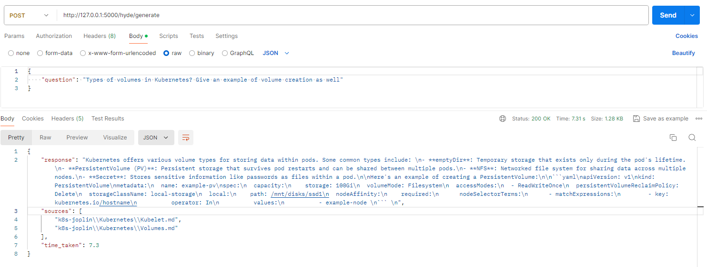

### Steps to Start

- Make sure the vectorDB and .env file exist in same hierarchy as Readme.md where .env file as variable `GOOGLE_API_KEY=<my_api_key>`
- Run command `python backend.py` to start the flask server that has API endpoints `/hyde/generate` and `/decomposition/generate` both which take postman request as `{question: question}`. Refer to below example - 

- It is possible that flask server might restart leading to failed request due to LLM and vector store retriever being stored as variables in flask server as well as windows timeout error. In such case, just send the request again via postman to verify. The error may look like following - 

```
Exception in thread Thread-4 (serve_forever):
Traceback (most recent call last):
  File "C:\Python312\Lib\threading.py", line 1073, in _bootstrap_inner
    self.run()
  File "C:\Python312\Lib\threading.py", line 1010, in run
    self._target(*self._args, **self._kwargs)
  File "D:\VS Code\python\dsa_projects\RAG\notes_rag\venv\Lib\site-packages\werkzeug\serving.py", line 810, in serve_forever
    super().serve_forever(poll_interval=poll_interval)
  File "C:\Python312\Lib\socketserver.py", line 235, in serve_forever
    ready = selector.select(poll_interval)
            ^^^^^^^^^^^^^^^^^^^^^^^^^^^^^^
  File "C:\Python312\Lib\selectors.py", line 323, in select
    r, w, _ = self._select(self._readers, self._writers, [], timeout)
              ^^^^^^^^^^^^^^^^^^^^^^^^^^^^^^^^^^^^^^^^^^^^^^^^^^^^^^^
  File "C:\Python312\Lib\selectors.py", line 314, in _select
    r, w, x = select.select(r, w, w, timeout)
              ^^^^^^^^^^^^^^^^^^^^^^^^^^^^^^^
OSError: [WinError 10038] An operation was attempted on something that is not a socket
 * Restarting with watchdog (windowsapi)
```

This is not a code error and so re-request to API will give API response.

