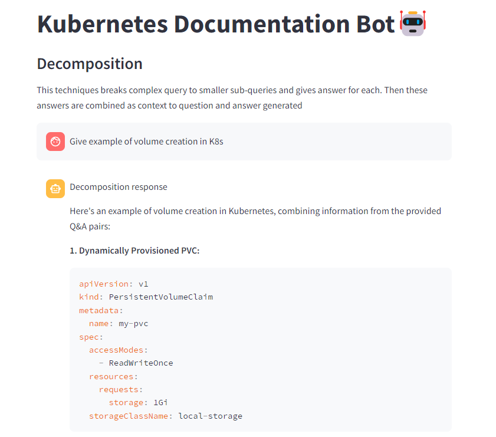
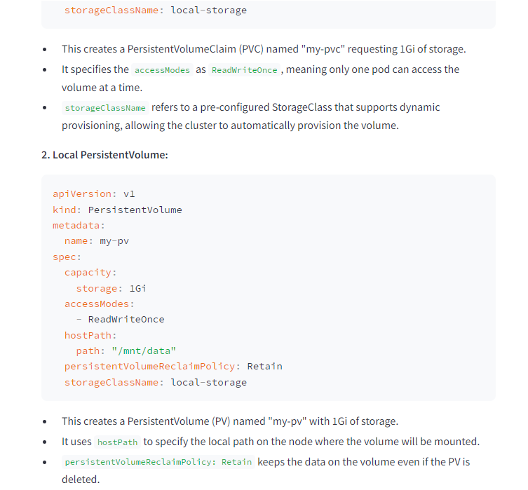
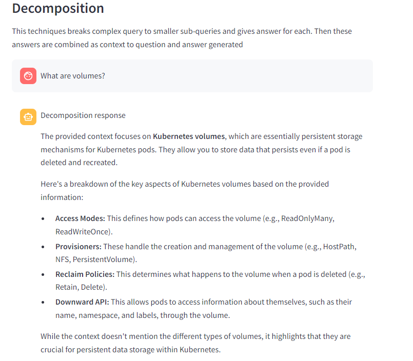
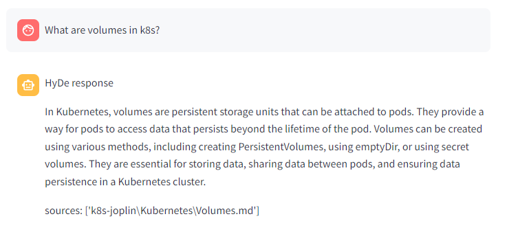
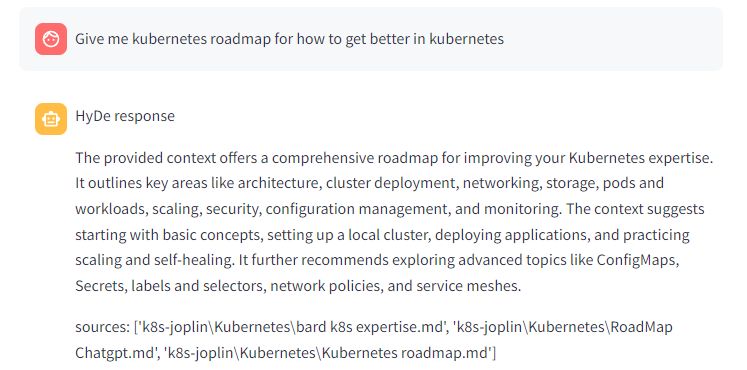
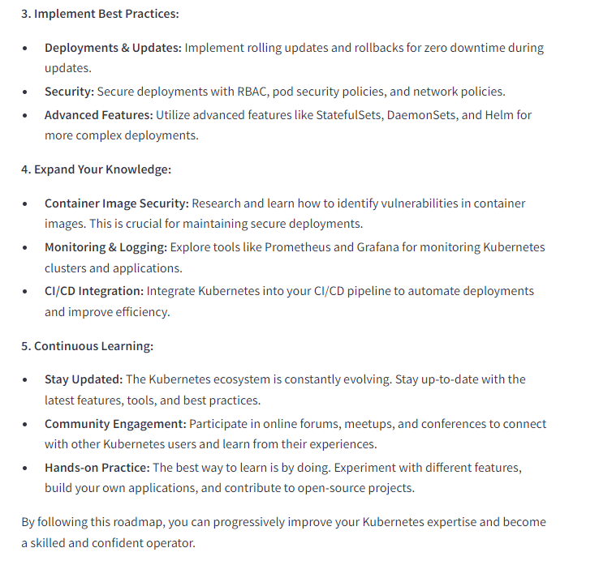
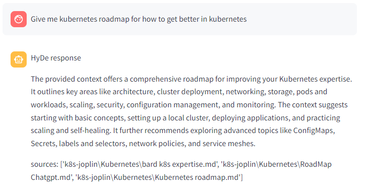

### Decompositon Examples

#### Example 1

#### Example 2

### HyDe Examples

#### Example 1

The reason why sources names are quite different as it is based upon personal notes in markdown format.

### Personal Takeaways

My takeways are that **Decomposition technique** performs very well for complex queries that require specific answers rather than generic answers. Here is one example for question - 

***

#### Q. Give me kubernetes roadmap for how to get better in kubernetes

#### Decomposition Response

### HyDe Response

***

I am pretty impressed by the decomposition approach and maybe I have to improve HyDe to get better responses as structured as decomposition ones.